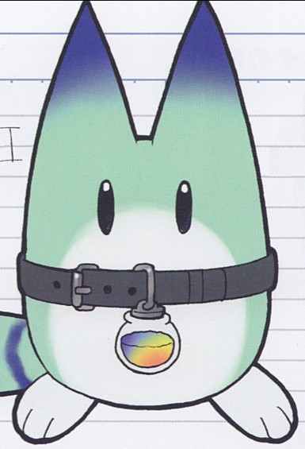
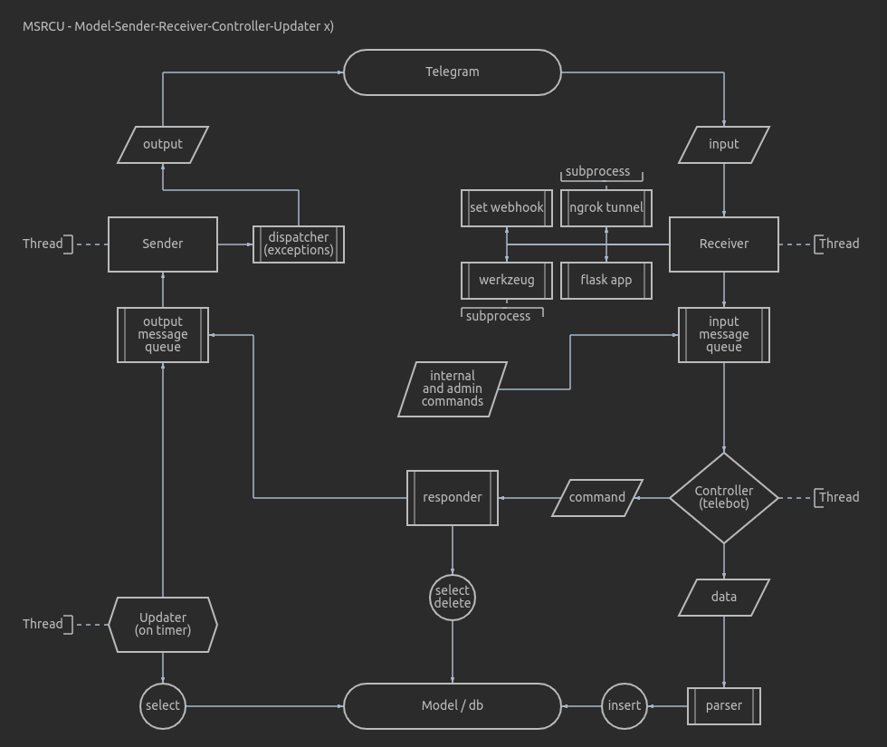

# LuckyBot (deprecated)

My second bot.
> https://t.me/LuckyBeast_bot

This bot was made to remind you of the things you don't want to forget.  
You can save text notes in the database. A couple of times a day LuckyBot will take a random note and send it to you.  
All notes are stored in an encrypted form.

## Bot architecture

If you want to run a copy, you need to get a bot API from BotFather.  
You also need following secrets:

- Webhook secret token - random urlsafe string
- salt - for hashing
- Encryption key - for Fernet
- Your Telegram UID - for admin commands

Look into the lucky_bot.helpers.constants.py for configuration.

